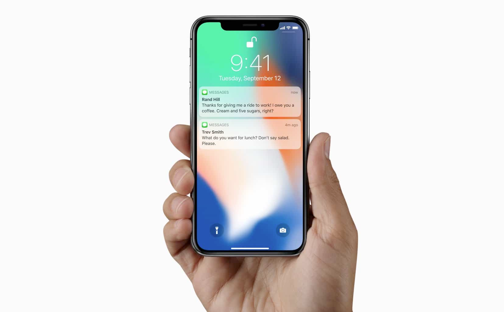

# Notification API

Date: 2024-03-01 The PDF - Personal Development Friday
Task https://aktivbo.atlassian.net/browse/AT-6075

## Background

In Atlas we have the packages/aktivbo/laravel_user_message. That can be used to send personal messages to the users of our applications. Also company wide messages are supported. Also supports general messages for everyone, but with no translations.

We can for example send out information that “Your Create survey now reached 25% answers”.

When that message is polled by Analytics we can use Javascript to send it to the notification system in the phone / computer so that it shows up among all other system notifications.

Benefits would be more engagement from our customers if they themself can set up limits and get notifications when those limits are reached.

* Notify me when I get 25% answers on this survey…
* Notify me if this survey ___ have less than __ % in any results.
* Notify me if we are below this benchmark on this survey and these indexes.
* Notify me if I have an action with a due date today
* Notify me when this action is marked as done
* Notify me if this survey get more negative text answers than positive.
* Notify me daily/weekly/monthly how it goes with this survey so I can go into Analytics and see the details
* Notify me when there is a new version of Analytics so I can click and see the release notes.

## This example

This example is the first step to Push Notification with the [Push API](https://developer.mozilla.org/en-US/docs/Web/API/Push_API). But that is for some other day. For now I will only explore the Notification API.

In this PDF task I will use the [Notification API](https://developer.mozilla.org/en-US/docs/Web/API/notification) and create an example code that shows that it works. I will publish that code to a web page so that everyone in the team can visit and see how it works with notifications.
More examples here: [How to use the Notification API](https://developer.mozilla.org/en-US/docs/Web/API/Notifications_API/Using_the_Notifications_API).

Things I like to find an answer to:

* Can the notification have a direct link to the place in Analytics where the notification is about?
* Can we have a custom icon in the Notification?
* Does it work the same on iPhone / Android / macOS / Linux / Windows?
* What browsers have the Notification API?

## Make it work

The Notification API require an HTTPS address. The browser need to trust the domain or else it will block the Notification API.

Use the [ROX](https://github.com/peterlembke/rox) local development environment to get HTTPS on your URLs.
Follow the instructions [here](https://github.com/peterlembke/rox/blob/main/images/web/certificates/README.md) to get it working with notifications in different browsers.

## Example #1 - How it looks like

In the Safari browser

In the Brave browser

In the Opera browser

In the FireFox browser

## Example #2 - Better permission handling

In this version I want to:
Enable the "Get notification" button if we have permission to send a notification.
Disable the "Ask for permission" button if we have permission to send a notification.
I want this check to be done in a function that enable/disable the button,
and show a text on screen what rights we have.

Asking for permission should be in a function.

Add links to the GitHub documentation